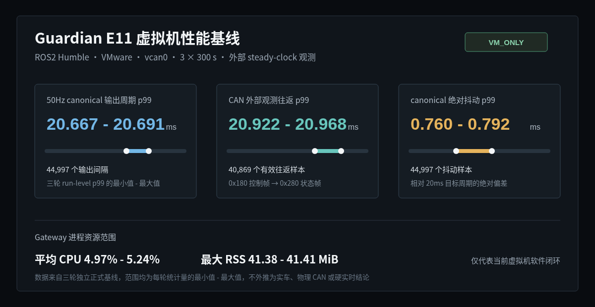

# ControlLink Guardian

ControlLink Guardian 是面向低速无人车和仓储 AMR 的 C++/ROS2 控制通信网关，位于 Nav2、遥控或规划控制模块与机器人、车辆执行层之间

它将多个控制来源收敛为唯一的 canonical control output，并集中处理通信契约、DDS QoS、来源身份、命令合法性、时效性、仲裁、故障降级与恢复，避免同一套控制安全规则分散在上游节点和不同执行平台中

## 运行链路

```text
Nav2 / teleop / planning-control
  -> ingress adapters
  -> Contract + QoS endpoint boundary
  -> source binding and command validation
  -> latest valid snapshots and source arbitration
  -> health state machine
  -> fixed-rate canonical output
  -> robot / vehicle adapters
  -> VehicleState + diagnostics + rosbag2
```

## 核心能力

- YAML 驱动的 Topic、QoS、来源策略、超时、速度边界和关键 endpoint 契约
- DDS Request-vs-Offered compatibility 与项目 exact policy 分层检查
- publisher GID generation、严格递增 sequence、ROS time 新鲜度与 steady-clock lease 校验
- priority、命令年龄和 `source_id` 组成的确定性仲裁，以及 teleop 接管与 fallback
- Lifecycle 资源管理、双 callback group、结构化 GatewayState、SourceStatus、VehicleState 和 diagnostics
- 固定 50Hz canonical 输出，非 ACTIVE 数据面状态持续发布软件层 HOLD
- adapter 本地看门狗和执行端结构化健康反馈，覆盖网关停发与平台反馈超时

## 两种运行 Profile

```text
Robot
Nav2 / teleop
  -> Twist ingress
  -> Guardian
  -> ros2_control adapter
  -> diff_drive_controller
  -> Gazebo

ADAS
planning / teleop
  -> Guardian
  -> SocketCAN adapter
  -> vcan0 0x180 / 0x280
  -> vehicle simulator
```

Robot 与 ADAS 复用相同的 Contract、命令校验、来源仲裁和状态治理核心，平台差异只留在 ingress、执行 adapter 与 bringup 边界

## Robot 仿真闭环

Robot Profile 使用 Nav2、AMCL、tf2、ros2_control 和 Gazebo，Gateway 的 canonical command 只能经执行 adapter 进入 `diff_drive_controller`

## 虚拟机性能基线



图中数据来自三轮独立的 300 秒 ROS2 Humble VMware/vcan 外部观测，统计范围只描述当前虚拟机软件闭环，不外推为实车、物理 CAN 或硬实时性能

## 技术栈

`C++17` · `ROS2 Humble` · `rclcpp Lifecycle` · `Fast DDS / RMW` · `yaml-cpp` · `Nav2` · `tf2` · `ros2_control` · `Gazebo` · `SocketCAN / vcan` · `rosbag2` · `GTest / launch_test`

## 能力边界

- Guardian 是控制通信与状态治理组件，不实现导航、感知、预测、规划或控制算法
- 普通 ROS Topic 和软件 HOLD 不承担硬实时急停或功能安全职责
- ADAS Profile 使用项目自有 vcan demo protocol，不冒充 OEM CAN、AUTOSAR 或量产车辆接口
- Fast DDS SHM transport 不等于应用层 zero-copy

## Package 边界

```text
control_link_interfaces  运行时消息定义
control_link_contract    YAML model/parser、QoS 与 endpoint compatibility
control_link_gateway     Lifecycle、校验、仲裁、状态机、调度与 diagnostics
control_link_adapters    Robot/ADAS 输入和执行平台适配
control_link_bringup     launch、URDF、地图、仿真、录制与回放编排
```

```text
公共控制主线
  /control_link/input/<source>
  -> command validation
  -> source arbitration
  -> /control_link/output/control_cmd

结构化反馈
  /control_link/state
  /control_link/source_status
  /control_link/vehicle_state
  /diagnostics
```

License: Apache-2.0
