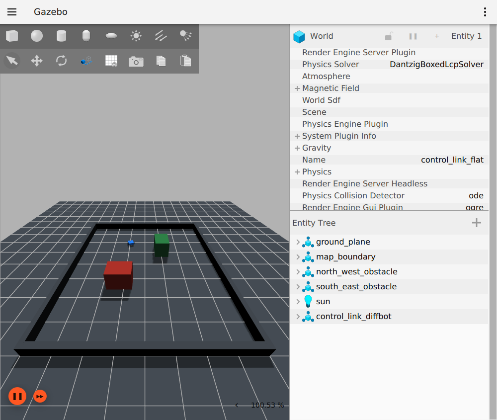

# ControlLink Guardian

ControlLink Guardian 是面向低速无人车和仓储 AMR 的 C++/ROS2 控制通信网关，位于 Nav2、遥控或规划控制模块与机器人、车辆执行层之间

它将多个控制来源收敛为唯一的 canonical control output，并集中处理通信契约、DDS QoS、来源身份、命令合法性、时效性、仲裁、故障降级与恢复，避免同一套控制安全规则分散在上游节点和不同执行平台中

## 运行链路

```text
Nav2 / teleop / planning-control
  -> ingress adapters
  -> Contract + QoS endpoint boundary
  -> source binding and command validation
  -> latest valid snapshots and source arbitration
  -> health state machine
  -> fixed-rate canonical output
  -> robot / vehicle adapters
  -> VehicleState + diagnostics + rosbag2
```

## 核心能力

- YAML 驱动的 Topic、QoS、来源策略、超时、速度边界和关键 endpoint 契约
- DDS Request-vs-Offered compatibility 与项目 exact policy 分层检查
- publisher GID generation、严格递增 sequence、ROS time 新鲜度与 steady-clock lease 校验
- priority、命令年龄和 `source_id` 组成的确定性仲裁，以及 teleop 接管与 fallback
- Lifecycle 资源管理、双 callback group、结构化 GatewayState、SourceStatus、VehicleState 和 diagnostics
- 固定 50Hz canonical 输出，非 ACTIVE 数据面状态持续发布软件层 HOLD
- adapter 本地看门狗和执行端结构化健康反馈，覆盖网关停发与平台反馈超时
- 基于语义配置哈希的 Contract 身份追踪，以及 Lifecycle 事务式重配置、Graph 验证和失败回滚
- 决策事件 JSONL 记录与离线确定性回放，复用生产 Validator、Arbiter 和 GatewayStateMachine
- 可由 ros2_control 加载的 mock `hardware_interface::SystemInterface`，支持执行链和故障传播验证

## 两种运行 Profile

```text
Robot
Nav2 / teleop
  -> Twist ingress
  -> Guardian
  -> ros2_control adapter
  -> diff_drive_controller
  -> Gazebo

ADAS
planning / teleop
  -> Guardian
  -> SocketCAN adapter
  -> vcan0 0x180 / 0x280
  -> vehicle simulator
```

Robot 与 ADAS 复用相同的 Contract、命令校验、来源仲裁和状态治理核心，平台差异只留在 ingress、执行 adapter 与 bringup 边界

## Robot 仿真闭环

Robot Profile 使用 Nav2、AMCL、tf2、ros2_control 和 Gazebo，Gateway 的 canonical command 只能经执行 adapter 进入 `diff_drive_controller`



## 运行演示

- [Robot Profile：Nav2、Guardian、ros2_control 与 Gazebo 控制闭环](assets/机器人控制闭环演示_1080p60.mp4)
- [ADAS Profile：Guardian、SocketCAN/vcan 与车辆状态反馈闭环](assets/ADAS控制闭环演示_1080p60.mp4)

两段视频均提供 1080p60 H.264/MP4 版本，分别展示 Robot 与 ADAS 运行链路中的网关状态、控制输入、canonical 输出和执行端反馈

## 快速运行

在已安装 ROS2 Humble 与项目依赖的 Ubuntu 环境中构建工作区：

```bash
cd ros2_ws
source /opt/ros/humble/setup.bash
colcon build --symlink-install --cmake-args -DCMAKE_BUILD_TYPE=RelWithDebInfo
source install/setup.bash
```

启动 Robot/Nav2/Gazebo 闭环：

```bash
ros2 launch control_link_bringup robot_demo.launch.py
```

首次创建 vcan 设备后启动 ADAS 软件闭环：

```bash
sudo modprobe vcan
sudo ip link add dev vcan0 type vcan
sudo ip link set vcan0 up
ros2 launch control_link_bringup adas_vcan_demo.launch.py can_interface:=vcan0
```

## 虚拟机性能基线

测试环境为 ROS2 Humble、Fast DDS、VMware 和 vcan，三轮独立运行均包含 30 秒 warm-up 与 300 秒 measurement，聚合结果通过配置、样本量、运行连续性和 artifact SHA-256 校验

| 指标 | 聚合样本数 | 三轮结果范围 |
|---|---:|---:|
| canonical output interval mean | 44,997 | 19.99996 - 20.00023 ms |
| canonical output interval p99 | 44,997 | 20.66683 - 20.69130 ms |
| canonical output absolute jitter p99 | 44,997 | 0.75989 - 0.79229 ms |
| command callback-to-output p99 | 22,500 | 6.65729 - 20.06467 ms |
| CAN control/state round-trip p99 | 40,869 | 20.92152 - 20.96797 ms |
| source switch external observation | 3 | 133.4353 - 739.1794 ms |

| 进程 | CPU mean | CPU max | RSS max |
|---|---:|---:|---:|
| Gateway | 4.97% - 5.24% | 6.01% - 7.00% | 42,372 - 42,404 KiB |
| SocketCAN Adapter | 2.51% - 2.79% | 4.00% - 4.00% | 42,216 - 42,380 KiB |
| Vehicle Simulator | 0.58% - 0.59% | 2.00% - 2.00% | 42,004 - 42,112 KiB |
| Control Source | 0.81% - 0.85% | 2.00% - 2.00% | 39,400 - 39,736 KiB |
| External Observer | 2.73% - 3.00% | 4.00% - 5.00% | 43,348 - 43,608 KiB |

source switch 每轮只有一个外部观察样本，起点不是 Gateway 内部 challenger 计时点，因此只展示范围，不作为稳定时延分布结论；全部数据只描述当前虚拟机软件闭环，不外推为实车、物理 CAN 或硬实时性能

## 技术栈

| 层次 | 技术与接口 |
|---|---|
| C++ 工程 | C++17、CMake、ament_cmake、colcon、RAII、标准库并发与 filesystem |
| ROS2 运行时 | ROS2 Humble、rclcpp Lifecycle、MultiThreadedExecutor、callback group、ROS Graph、rosidl、diagnostics |
| DDS 通信 | Fast DDS、RMW、QoS Request-vs-Offered compatibility、endpoint GID、SHM transport |
| 机器人系统 | Nav2、AMCL、tf2、ros2_control、pluginlib、diff_drive_controller、Gazebo |
| Linux 与车辆链路 | SocketCAN/PF_CAN、vcan、poll、eventfd、独立 I/O thread、CRC 与 rolling counter |
| 配置与可靠性 | yaml-cpp、OpenSSL SHA-256、JSONL decision trace、确定性回放、事务式重配置与回滚 |
| 测试与证据 | GTest、launch_testing、pytest、rosbag2、ldd -r、GitHub Actions |

## 能力边界

- Guardian 是控制通信与状态治理组件，不实现导航、感知、预测、规划或控制算法
- 普通 ROS Topic 和软件 HOLD 不承担硬实时急停或功能安全职责
- ADAS Profile 使用项目自有 vcan demo protocol，不冒充 OEM CAN、AUTOSAR 或量产车辆接口
- Fast DDS SHM transport 不等于应用层 zero-copy

## Package 边界

```text
control_link_interfaces  运行时消息定义
control_link_contract    YAML model/parser、QoS 与 endpoint compatibility
control_link_gateway     Lifecycle、校验、仲裁、状态机、调度与 diagnostics
control_link_adapters    Robot/ADAS 输入和执行平台适配
control_link_bringup     launch、URDF、地图、仿真、录制与回放编排
```

```text
公共控制主线
  /control_link/input/<source>
  -> command validation
  -> source arbitration
  -> /control_link/output/control_cmd

结构化反馈
  /control_link/state
  /control_link/source_status
  /control_link/vehicle_state
  /diagnostics
```

License: Apache-2.0
